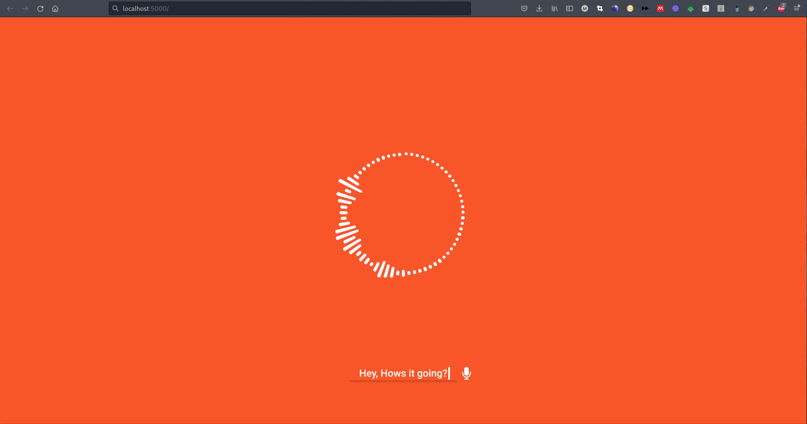
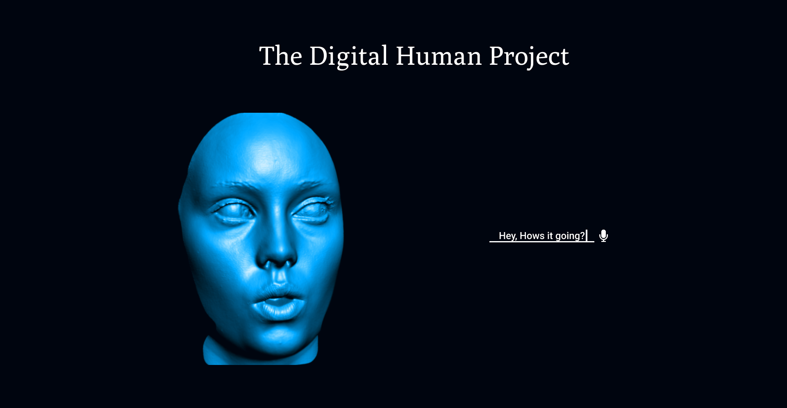

# The Digital Human Project

## v1.0: Samantha



Implementation of Samantha chatbot from >)

Related works: https://github.com/ali-essam/Her-OS-One-Samantha-Experiment

## v1.5 Kara

Implementation of Kara: The Digital Human ( now, with face! :P )



Cedits:

The mesh is from The 
The name "Kara" is inspired by 

## SETUP

```bash
git clone https://github.com/Juppiter-AI-Labs/GPT-3-Chatbot.git
cd GPT-3-Chatbot
git checkout rasa
```

NOTE: Make sure pip version is <=20.2.

### Installing backend dependencies.

Install rasa and rasa-x

```bash
pip install rasa[full]
pip install rasa-x --extra-index-url https://pypi.rasa.com/simple
```

### Install the frontend dependencies

P.S: Make sure yarn is installed, if not follow [these instructions](https://classic.yarnpkg.com/en/docs/install/#debian-stable)

```
cd frontend
yarn install

```

### Setting up your api key.

create a gpt_key.json file

```bash
cd rasa
touch gpt_key.json

```

add your api key in gpt_key.json

```bash

# inside gpt_key.json
{ "key": "your-api-key-here." }

```

## RUN THE APP

automatically setup all the servers and serve our webapp in localhost:8080

```bash

chmod +x run_script.sh
./run_script.sh
```
